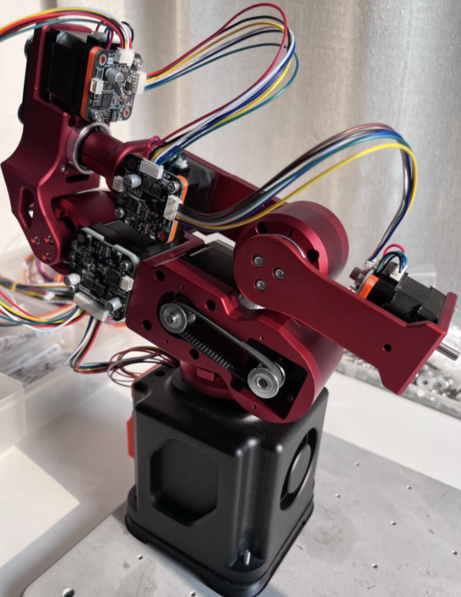
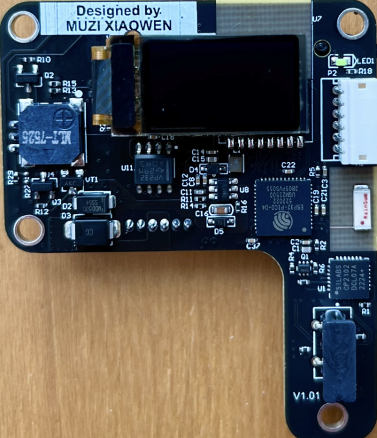
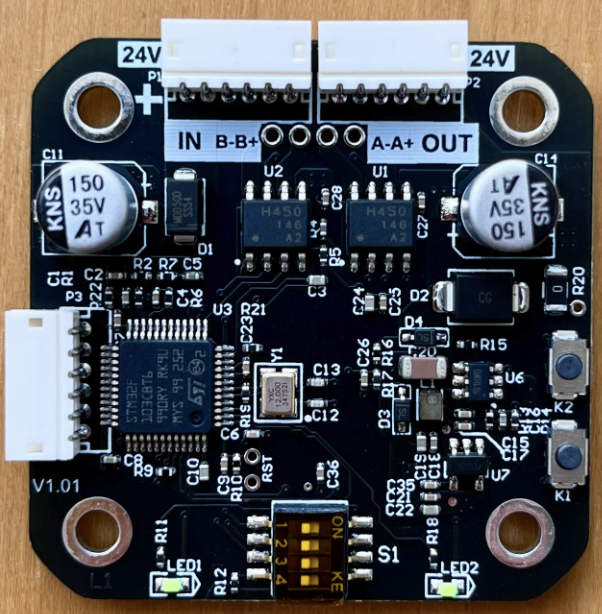
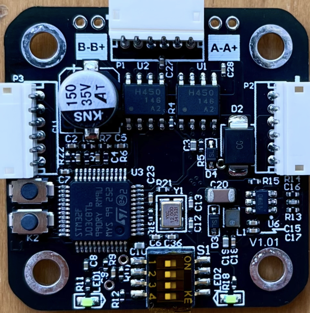

# Dummy - 机械臂项目

稚晖君dummy复制，目标是全国产谐波减速器，价格在3000元之内！



---

## 🚀 快速开始

**新用户？** 从这里开始 → [`START_HERE.md`](START_HERE.md)

**需要调试？** 5分钟上手 → [`QUICK_START_DEBUG.md`](QUICK_START_DEBUG.md)

**完整工作流？** 查看这里 → [`WORKFLOW.md`](WORKFLOW.md)

---
1. 目录描述
- **Firmware** - ref控制板、42/35驱动板源代码
- **Hardware** - ref控制板、42/35驱动板 schematic & PCB 文件
- **3d-model** - 所有 3D 打印文件
- **ESP32-iot** - ESP32 支持文件
- **rst-control-fw** - STM32F103 控制固件（带 CubeMX 配置）
- **docs** - 调试文档、硬件资料
- **openocd-configs** - OpenOCD 调试配置

1. 重新设计的ref控制板

- 简化设计，更适合量产
1. 修改所有1.0mm的连接器为插针1.5mm，fix原版连接器容易脱落
1. 删除base板，将base板子集成到了主板上
1. 添加switching ldo，供电电流最大2A，fix原版mcu ldo电流过小，温度过高issue
1. 将led ring，buzzer 控制从ESP32 改到stm32 mcu
1. 更合理的布局
1. 降低量产成本

---

## 🛠️ 开发环境

### 硬件要求
- STM32 开发板（F103ZE / F405RG）
- 调试器：CMSIS-DAP（野火 DAP 小智款）/ ST-Link V2 / WCH-Link
- USB 数据线
- SWD 连接线

### 软件要求
- **STM32CubeMX** - 外设配置和代码生成
- **VSCode** - 代码编辑和调试
- **arm-none-eabi-gcc** - 交叉编译工具链
- **OpenOCD** - 调试服务器
- **GDB** - 调试器

### 调试环境配置

✅ **已配置完成** - 包含完整的调试环境

- 8 个 VSCode 一键调试配置（按 F5 即可）
- 支持 3 种调试器（DAP / ST-Link / WCH-Link）
- OpenOCD 自动连接和烧录
- GDB 命令模板和故障排查指南
- Claude AI 远程调试协助

**快速开始调试:**
```bash
# 1. 连接硬件（DAP → USB → PC，SWD → 开发板）
# 2. 测试连接
cd openocd-configs
bash test-connection.sh

# 3. 在 VSCode 中按 F5 开始调试
```

**详细文档:**
- [`QUICK_START_DEBUG.md`](QUICK_START_DEBUG.md) - 5 分钟快速上手
- [`WORKFLOW.md`](WORKFLOW.md) - 完整开发工作流
- [`docs/DEBUGGING_GUIDE.md`](docs/DEBUGGING_GUIDE.md) - 完整调试教程
- [`docs/CLAUDE_REMOTE_DEBUG.md`](docs/CLAUDE_REMOTE_DEBUG.md) - AI 远程协助

---

1. 重新设计的42/35驱动板




- 42/35驱动板正式版
1. 所有连接器改为1.5mm 3A 座子，更适合量产
1. 电源线复用两根1007/26号线，最大支持到3A
1. CAN BUS ID 通过板载拨码开关设置
