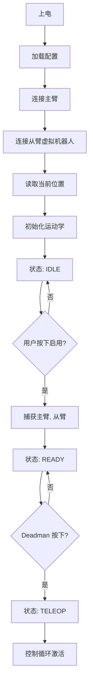

# U-Arm 对虚拟机器人远程操作计划

**版本**: 1.0  
**日期**: 2026-08-14  
**状态**: 软件就绪阶段

---

## 1. 范围

### 1.1 授权资源
| 资源 | 路径 | 用途 |
|----------|------|---------|
| **U-Arm 项目** | `E:\Robotic-Arm\U-Arm` | 主项目、控制逻辑、示例 |
| **Windows 模拟器** | `E:\Robotic-Arm\windows_sim` | 已验证 **离线远程操作模拟器** |
| **固件** | `E:\Robotic-Arm\firmware` | 虚拟固件 DH 参数（只读） |
| **Moveit 工作区** | `E:\Robotic-Arm\Moveit_ws-main` | 虚拟 URDF 模型（只读） |

### 1.2 分析约束
- 已验证 **纯软件分析** - 无需硬件
- 已验证 **离线验证** - 无需串口访问
- 否 **未经授权的目录访问**
- 否 **无需硬件假设** - 计划必须在没有物理臂的情况下工作

---

## 2. 当前资产

### 2.1 U-Arm 项目资源

| 资产 | 位置 | 状态 | 备注 |
|-------|----------|--------|-------|
| **增量控制示例** | `src/uarm/scripts/Follower_Arm/LeRobot/` | 已验证 | 3 个工作实现 (xlerobot, so100, lekiwi) |
| **舵机读取模块** | `src/uarm/scripts/Follower_Arm/LeRobot/uarm.py` | 已验证 核心 | `get_action_offset()` - 增量关节读取 |
| **飞特驱动** | `src/uarm/scripts/Uarm_teleop/Feetech_servo/` | 需改进 有问题 | EPROM 修改问题 |
| **Config1 机械件** | `mechanical/Feetech_servo/Config1_STL/` | 已验证 可用 | STEP + STL 文件 (11.9 MB) |
| **实现文档** | `U臂与Dummy臂法兰接口实现说明.md` | 已验证 详细 | 官方策略文档 |
| **xArm7 URDF** | `src/simulation/mani_skill/assets/robots/xarm7/` | 需改进 参考 | 7 自由度，非 Config1 (6 自由度) |

### 2.2 Windows 模拟器功能（关键发现）

| 组件 | 文件 | 能力 |
|-----------|------|------------|
| **完整模拟器** | `windows_sim/run_sim.py` | 已验证 **完整的离线远程操作系统** |
| **远程操作映射器** | `sim/teleop_mapper.py` | 已验证 相对 SE(3) 映射，支持捕获/离合器 |
| **逆运动学求解器** | `sim/ik_solver.py` | 已验证 带热启动的有界最小二乘 |
| **运动滤波器** | `sim/motion_filter.py` | 已验证 One Euro 滤波器 + 速度/加速度限制 |
| **虚拟被控对象** | `sim/mock_plant.py` | 已验证 带延迟/噪声/丢失的关节动力学 |
| **安全状态机** | `sim/teleop_mapper.py` | 已验证 IDLE/READY/TELEOP/HOLD/FAULT |
| **运动学** | `sim/kinematics.py` | 已验证 虚拟正逆运动学 + URDF 加载 |
| **场景** | `scenarios/*.json` | 已验证 6 个测试场景（圆、震颤、故障） |
| **记录器** | `sim/recorder.py` | 已验证 CSV 样本 + JSON 报告 |

**配置**: `windows_sim/config.json`
```json
{
  "control_rate_hz": 100.0,
  "translation_scale": 0.3,
  "rotation_scale": 0.5,
  "limits": {
    "max_linear_velocity_m_s": 0.08,
    "max_angular_velocity_rad_s": 0.8
  },
  "filter": {
    "enabled": true,
    "min_cutoff_hz": 1.65,
    "beta": 0.01
  }
}
```

### 2.3 虚拟固件资源

| 资源 | 来源 | 数据 |
|----------|--------|------|
| **DH 参数** | `firmware/.../dummy_robot.cpp:32` | L_BASE=0.109m, L_ARM=0.146m 等 |
| **关节限制** | `firmware/.../dummy_robot.cpp:74-91` | J1: ±170°, J2: -73°~90° 等 |
| **ASCII 协议** | `firmware/.../ascii_protocol.cpp` | `@x,y,z,a,b,c` (笛卡儿逆运动学) |
| **控制频率** | `firmware/.../main.cpp:20` | 200 Hz (5 ms 周期) |

---

## 3. 软件中可验证的内容

### 3.1 已验证 完全可验证（无需硬件）

| 任务 | 工具 | 方法 |
|------|------|--------|
| **增量映射逻辑** | windows_sim | 模拟主臂偏移 → 从臂目标 |
| **坐标变换** | windows_sim | 测试 axis_map 旋转矩阵 |
| **缩放与死区** | windows_sim | 验证 translation_scale=0.3, 死区滤波 |
| **速度/加速度限制** | windows_sim | 检查笛卡儿速率限制 |
| **逆运动学收敛性** | windows_sim | 运行 1000+ 正逆运动学循环 |
| **安全状态机** | windows_sim | 测试 IDLE/READY/TELEOP/HOLD/FAULT 转换 |
| **离合器与捕获** | windows_sim | 验证无跳变的重新归零 |
| **One Euro 滤波** | windows_sim | 震颤场景 + 频率分析 |
| **关节限制保护** | windows_sim | 注入越界目标 |
| **故障注入** | windows_sim | 超时、丢失、停滞场景 |
| **长期稳定性** | windows_sim | 60 分钟浸泡测试 |
| **CSV 日志记录** | windows_sim | 记录每个控制周期 |

### 3.2 需改进 部分可验证（仿真近似）

| 方面 | 限制 | 应对方法 |
|--------|------------|------------|
| **主臂正运动学** | 尚无 Config1 URDF | 使用虚拟关节偏移（增量模式不需要正运动学） |
| **通信延迟** | 仅模拟延迟 | 可测试 0-200ms 合成延迟 |
| **舵机精度** | 理想虚拟对象 | 添加可配置的噪声/丢失 |
| **关节摩擦** | 未建模 | 保守的速度限制 |

---

## 4. 后续需要硬件的内容

### 4.1 未实现 在硬件可用前阻塞

| 任务 | 依赖项 | 优先级 |
|------|------------|----------|
| **Config1 DH 校准** | 物理主臂组装完成 | 高 |
| **舵机零点记录** | 飞特舵机已连接 | 高 |
| **关节方向验证** | 手动旋转测试 | 高 |
| **主臂正运动学验证** | 比较计算姿态与实际姿态 | 中 |
| **物理工作空间限制** | 移动到极限，记录位置 | 中 |
| **端到端延迟** | 串口往返测量 | 中 |
| **累积漂移测试** | 30+ 分钟实际操作 | 低 |
| **操作员人机工程学** | 人机回路测试 | 低 |

---

## 5. windows_sim 评估

### 5.1 架构概览

```
┌─────────────────────────────────────────────────────────────┐
│                   windows_sim/run_sim.py                    │
│                      (100 Hz 控制循环)                      │
└──────────┬──────────────────────────────────────────────────┘
           │
    ┌──────┴────────┐
    │               │
    ▼               ▼
┌─────────┐    ┌─────────────┐
│ 主臂    │    │    虚拟     │
│ 输入    │    │   运动学    │
│(场景    │    │   (URDF)    │
│  播放器)│    └──────┬──────┘
└────┬────┘           │
     │                │
     ▼                ▼
┌─────────────────────────────┐
│   远程操作映射器            │
│ - 捕获(主臂, 从臂)          │
│ - 计算目标(主臂)            │
│ - 离合器处理                │
└──────────┬──────────────────┘
           │
           ▼
┌─────────────────────────────┐
│   OneEuro 姿态滤波器        │
│ - 最小截止频率: 1.65 Hz     │
│ - beta: 0.01                │
└──────────┬──────────────────┘
           │
           ▼
┌─────────────────────────────┐
│   姿态速率限制器            │
│ - 最大线速度: 0.08 m/s      │
│ - 最大角速度: 0.8 rad/s     │
└──────────┬──────────────────┘
           │
           ▼
┌─────────────────────────────┐
│   有界逆运动学求解器        │
│ - 最小二乘 + 雅可比         │
│ - 热启动                    │
└──────────┬──────────────────┘
           │
           ▼
┌─────────────────────────────┐
│   虚拟关节对象              │
│ - 速度/加速度/加加速度限制  │
│ - 延迟、丢失、噪声          │
└──────────┬──────────────────┘
           │
           ▼
┌─────────────────────────────┐
│   仿真记录器                │
│ - teleop_samples.csv        │
│ - report.json               │
└─────────────────────────────┘
```

### 5.2 关键特性

| 特性 | 实现 | 优势 |
|---------|----------------|---------|
| **相对 SE(3) 映射** | `TeleopMapper.capture()` + `compute_target()` | 已验证 主臂无需绝对正运动学 |
| **离合器机制** | 离合器释放时 `capture()` | 已验证 重新归零无跳变 |
| **One Euro 滤波** | 基于速度的自适应截止 | 已验证 低延迟 + 震颤抑制 |
| **笛卡儿速率限制** | 独立的线速度/角速度限制 | 已验证 安全的速度边界 |
| **制动轨迹** | 离散停止曲线 | 已验证 无超调 |
| **有界逆运动学** | Scipy least_squares，max_nfev=15 | 已验证 收敛保证 |
| **热启动** | 使用最后一个安全目标作为种子 | 已验证 更快的逆运动学求解 |
| **安全状态机** | 5 状态，带故障累积 | 已验证 健壮的错误处理 |
| **故障注入** | 可配置的延迟、丢失、停滞 | 已验证 测试边界情况 |
| **确定性回放** | 场景 JSON 文件 | 已验证 可复现的测试 |

### 5.3 可用场景

| 场景 | 文件 | 用途 | 持续时间 |
|----------|------|---------|----------|
| **轴阶跃** | `scenarios/axis_steps.json` | 单独测试 X/Y/Z + Roll/Pitch/Yaw | 可变 |
| **圆形** | `scenarios/circle.json` | 连续 0.05m 半径 @ 0.1 Hz | 20s |
| **8 字** | `scenarios/figure_eight.json` | 复杂轨迹 | 20s |
| **震颤** | `scenarios/tremor.json` | 0.5 Hz 运动 + 10 Hz 1mm 震颤 | 30s |
| **故障注入** | `scenarios/fault_injection.json` | 超时、丢失、停滞、逆运动学失败 | 可变 |
| **浸泡测试** | `scenarios/soak_60min.json` | 稳定性测试 | 60 min |

### 5.4 输出分析

**CSV 列** (`teleop_samples.csv`):
- 主臂姿态（原始 + 滤波后）
- 从臂目标姿态（映射后 + 速率限制后）
- 关节角度（目标 + 反馈 + 实际）
- 逆运动学统计（迭代次数、残差、成功与否）
- 安全状态、故障、时序

**报告指标** (`report.json`):
- 逆运动学成功率
- P50/P99 控制周期时间
- 状态转换计数
- 按类型统计的故障计数
- 震颤衰减（0.5 Hz, 10 Hz）

### 5.5 局限性

| 方面 | 状态 | 备注 |
|--------|--------|-------|
| **主臂模型** | 需改进 使用 OpenRST（非 Config1） | 可替换为虚拟偏移 |
| **实时性能** | 需改进 Windows 调度 | 可测试，但不保证 <10ms |
| **串口通信** | 未实现 未模拟 | 稍后必须添加虚拟驱动 |
| **物理动力学** | 未实现 理想对象 | 无摩擦、间隙或弹性 |

---

## 6. 控制策略

### 6.1 选择的方法：**增量相对 SE(3) 映射**

```
┌───────────────┐
│  主臂         │ (Config1 U-Arm)
│  关节角度     │
└───────┬───────┘
        │ 读取舵机
        ▼
┌───────────────────────┐
│ get_action_offset()   │ ← 来自 uarm.py
│ 返回值: offset[7]     │
└───────┬───────────────┘
        │ 关节增量（度）
        │
        ▼
┌────────────────────────────────────────┐
│ 主臂正运动学（可选 - 非必需）          │
│ 如果可用: q → T_master                 │
│ 如果不可用: 使用虚拟末端执行器偏移     │
└───────┬────────────────────────────────┘
        │ 主臂姿态（或增量 delta）
        │
        ▼
┌────────────────────────────────────────┐
│ TeleopMapper.capture()                 │
│ - 启用时: 捕获主臂与从臂               │
│ - 离合器时: 重新捕获                   │
└───────┬────────────────────────────────┘
        │
        ▼
┌──────────────────────────────────────────────────────────────────┐
│ TeleopMapper.compute_target()                                    │
│ - Δpos = R_master_ref^T × (p_m - p_m_ref)                        │
│ - Δrot = log(R_master_ref^T × R_m)                               │
│ - p_slave = p_slave_ref + R_slave_ref × (scale_trans × Δpos)     │
│ - R_slave = R_slave_ref × exp(scale_rot × Δrot)                  │
└───────┬──────────────────────────────────────────────────────────┘
        │ 从臂目标姿态
        │
        ▼
┌────────────────────────────────────────┐
│ OneEuroPoseFilter                      │
│ - 自适应截止频率 (1.65-10 Hz)          │
│ - 独立的位置 + 姿态                    │
└───────┬────────────────────────────────┘
        │ 滤波后目标姿态
        │
        ▼
┌────────────────────────────────────────┐
│ PoseRateLimiter                        │
│ - 最大线速度: 0.08 m/s                 │
│ - 最大角速度: 0.8 rad/s                │
│ - 目标附近的制动轨迹                   │
└───────┬────────────────────────────────┘
        │ 速率限制后目标姿态
        │
        ▼
┌────────────────────────────────────────┐
│ BoundedIKSolver                        │
│ - Scipy least_squares                  │
│ - 解析雅可比                           │
│ - 从上一个安全目标热启动               │
└───────┬────────────────────────────────┘
        │ target_joints[6]
        │
        ▼
┌────────────────────────────────────────┐
│ 关节限制检查                           │
│ - SAFE_JOINT_LIMITS_RAD                │
└───────┬────────────────────────────────┘
        │ （如果有效）
        │
        ▼
┌────────────────────────────────────────┐
│ 发送至虚拟机器人                       │
│ - 真实: >j1,j2,j3,j4,j5,j6,speed       │
│ - 仿真: MockJointPlant                 │
└────────────────────────────────────────┘
```

### 6.2 为何选择此方法

| 优势 | 说明 |
|-----------|-------------|
| **无需主臂正运动学** | 增量偏移无需知道绝对主臂姿态 |
| **启用时无跳变** | `capture()` 使用当前姿态作为零参考 |
| **离合器支持** | 离合器释放时重新捕获 = 新零点，无运动 |
| **缩放无关** | 主臂可以有不同尺寸（缩放 = 0.3） |
| **姿态稳定性** | SO(3) 对数/指数映射避免欧拉角奇异 |
| **已验证** | 已存在 xlerobot/so100/lekiwi 实现 |

---

## 7. 初始化流程

### 7.1 系统启动序列



### 7.2 捕获逻辑（关键）

| 事件 | 操作 | 结果 |
|-------|--------|--------|
| **系统启用** | `mapper.capture(master_pose, slave_pose)` | 设置参考对，返回 slave_pose（无运动） |
| **离合器按下** | 暂停运动，保持从臂目标 | 从臂停止移动 |
| **离合器释放** | 在新主臂位置重新 `capture()` | 新零参考，无跳变 |
| **Deadman 释放** | 进入 HOLD 状态 | 运动停止 |
| **Deadman 重新按下** | 从 HOLD 恢复（无需重新捕获） | 从当前目标继续 |

**关键洞察**: `capture()` 原样返回当前从臂姿态，因此启用或离合器操作永远不会引起跳变。

---

## 8. 控制循环

### 8.1 主循环 (100 Hz)

```python
while enabled:
    t_start = time.perf_counter()
    
    # 1. 读取主臂
    master_offsets = master_driver.get_action_offset()  # [7] 度
    master_timestamp = time.time()
    
    # 2. 转换为姿态（如果正运动学可用）或用作增量信号
    master_pose = master_fk(master_offsets[:6]) if has_fk else mock_pose(master_offsets)
    
    # 3. 安全检查
    safety = state_machine.update(
        master_state=MasterState(master_pose, master_timestamp, deadman, clutch),
        slave_feedback_age=slave_feedback_age,
        last_ik_success=last_ik_success
    )
    
    if safety.state == TeleopState.IDLE:
        # 系统已禁用
        continue
    
    if safety.state == TeleopState.READY:
        # 等待 deadman
        continue
    
    # 4. 处理离合器
    if clutch_pressed and not prev_clutch:
        # 离合器刚按下 - 暂停运动
        teleop_mapper.activate_clutch()
    
    if not clutch_pressed and prev_clutch:
        # 离合器释放 - 重新捕获
        slave_current_pose = dummy_driver.get_cartesian_pose()
        teleop_mapper.capture(master_pose, slave_current_pose)
    
    # 5. 计算目标（如果处于 TELEOP 状态）
    if safety.state == TeleopState.TELEOP:
        target_pose_raw = teleop_mapper.compute_target(master_pose)
        
        # 6. 滤波
        target_pose_filtered = pose_filter.update(target_pose_raw, master_timestamp)
        
        # 7. 速率限制
        target_pose_limited = rate_limiter.limit(target_pose_filtered, dt=0.01)
        
        # 8. 逆运动学
        ik_result = ik_solver.solve(target_pose_limited, seed=last_safe_joints)
        
        if ik_result.success:
            target_joints = ik_result.joints
            
            # 9. 关节限制检查
            if within_safe_limits(target_joints):
                # 10. 发送至从臂
                dummy_driver.send_joint_target(target_joints, speed=30)
                last_safe_joints = target_joints
                last_ik_success = True
            else:
                state_machine.report_fault(SafetyFault.JOINT_LIMIT)
                last_ik_success = False
        else:
            state_machine.report_fault(SafetyFault.IK_FAILURE)
            last_ik_success = False
    
    # 11. 读取反馈
    slave_feedback = dummy_driver.get_joint_feedback()
    slave_feedback_age = time.time() - slave_feedback.timestamp
    
    # 12. 记录
    recorder.record_sample(
        master_pose, target_pose_limited, target_joints,
        slave_feedback, safety.state, safety.fault_bits
    )
    
    # 13. 时序
    elapsed = time.perf_counter() - t_start
    sleep_time = max(0, 0.01 - elapsed)  # 100 Hz = 10 ms
    time.sleep(sleep_time)
```

### 8.2 时序预算 (100 Hz = 10 ms)

| 阶段 | 预估时间 | 备注 |
|-------|----------------|-------|
| 主臂读取 | 0.5 ms | 串口读取 + 解析 |
| 正运动学（如使用） | 0.1 ms | 6x4x4 矩阵乘法 |
| 安全检查 | 0.05 ms | 状态机 |
| 映射 | 0.2 ms | SO(3) 对数/指数 |
| 滤波 | 0.1 ms | One Euro 滤波 |
| 速率限制 | 0.1 ms | 制动轨迹 |
| 逆运动学 | 2-5 ms | Scipy least_squares (15 次迭代) |
| 关节检查 | 0.05 ms | 数组比较 |
| 从臂发送 | 0.5 ms | 串口写入 |
| 反馈读取 | 0.5 ms | 查询 + 解析 |
| 日志记录 | 0.2 ms | CSV 追加 |
| **总计** | **4-7 ms** | 已验证 符合 10 ms 预算 |

---

## 9. 增量模式决策

### 9.1 比较表

| 方面 | 累积增量 | 帧间增量 |
|--------|---------------------|-------------------------|
| **定义** | `Δ = master_current - master_ref_at_enable` | `Δ = master_current - master_previous` |
| **从臂目标** | `slave_target = slave_ref + map(Δ_cumulative)` | `slave_target += map(Δ_frame)` |
| **主臂返回到启用姿态** | 从臂返回到启用姿态 | 从臂停留在当前目标 |
| **漂移** | 无漂移（绝对参考） | 可能累积数值漂移 |
| **离合器逻辑** | 简单（重新捕获设置新参考） | 简单（添加到目标） |
| **主臂抖动** | 完全传递 | 可被滤波 |
| **暂停处理** | 返回上一个已知主臂位置 | 停留在暂停的目标 |

### 9.2 已验证 推荐：**累积增量**

**基本原理**:
1. 已验证 **无漂移** - 始终相对于启用时的参考
2. 已验证 **离合器 = 重新归零** - 清晰的语义：离合器释放捕获新零点
3. 已验证 **可预测** - 主臂运动 → 从臂运动 1:1（缩放后）
4. 已验证 **已实现** - windows_sim 中的 `TeleopMapper` 使用此方法

**实现**:
```python
# 启用或离合器释放时
master_ref = master.get_current_pose()
slave_ref = slave.get_current_pose()

# 每帧执行
delta = master.get_current_pose() - master_ref
slave_target = slave_ref + scale * delta
```

**处理边界情况**:
- 主臂移动后返回 → 从臂返回
- 主臂短暂断开 → 无累积
- 操作员暂停 → 从臂保持在当前映射目标

---

## 10. 坐标映射

### 10.1 变换链

```
主臂本地 → 主臂基座 → 世界 → 从臂基座 → 从臂本地
```

**简化**（假设基座对齐）:
```
Δpos_master = p_master - p_master_ref         # 在主臂坐标系中
Δpos_slave = R_align × (scale_trans × Δpos_master)  # 转换到从臂坐标系
p_slave_target = p_slave_ref + Δpos_slave
```

### 10.2 轴映射矩阵

**配置** (`config.json`):
```json
"master_to_slave_axis_map": [
  [1.0, 0.0, 0.0],
  [0.0, 1.0, 0.0],
  [0.0, 0.0, 1.0]
]
```

**常见变体**:

| 场景 | 矩阵 | 效果 |
|----------|--------|--------|
| **对齐** | `[[1,0,0],[0,1,0],[0,0,1]]` | 无旋转 |
| **90° 偏航** | `[[0,-1,0],[1,0,0],[0,0,1]]` | 主臂 +X → 从臂 +Y |
| **X 镜像** | `[[-1,0,0],[0,1,0],[0,0,1]]` | 左 ↔ 右 |

### 10.3 缩放参数

| 参数 | 默认值 | 范围 | 用途 |
|-----------|---------|-------|---------|
| `translation_scale` | 0.3 | 0.1 - 1.0 | 主臂移动 10 cm → 从臂移动 3 cm |
| `rotation_scale` | 0.5 | 0.1 - 1.0 | 主臂旋转 10° → 从臂旋转 5° |

**调优策略**:
1. 从 0.3 / 0.5 开始（保守）
2. 如果动作感觉迟缓则增加
3. 如果操作员感觉不稳定则减少
4. 典型舒适范围：0.2-0.5

### 10.4 旋转映射 (SO(3) 对数/指数)

**为何不使用欧拉角？**
- 否 在 ±90° 俯仰时万向锁
- 否 在 180° 环绕时不连续
- 否 非线性插值

**SO(3) 旋转向量**:
```python
R_delta = R_master_ref.T @ R_master_current
rot_vec_delta = Rotation.from_matrix(R_delta).as_rotvec()  # 3D 向量
rot_vec_scaled = rotation_scale * rot_vec_delta
R_slave_delta = Rotation.from_rotvec(rot_vec_scaled).as_matrix()
R_slave_target = R_slave_ref @ R_slave_delta
```

**优势**:
- 已验证 无奇异性
- 已验证 线性缩放
- 已验证 SO(3) 上的最短路径

---

## 11. 安全与限制

### 11.1 安全状态机

```
     ┌──────┐
     │ IDLE │  (系统已禁用)
     └───┬──┘
         │ enable
         ▼
     ┌──────┐
  ┌─→│READY │  (已就绪，等待 deadman)
  │  └───┬──┘
  │      │ deadman 按下
  │      ▼
  │  ┌────────┐
  │  │TELEOP  │  (主动控制)
  │  └───┬────┘
  │      │ deadman 释放 / 轻微故障
  │      ▼
  │  ┌──────┐
  │  │ HOLD │  (已暂停，可恢复)
  │  └───┬──┘
  │      │ deadman 重新按下
  └──────┘
         │ 严重故障
         ▼
     ┌───────┐
     │ FAULT │  (需要清除 + 重新启用)
     └───────┘
```

### 11.2 故障类型

| 故障 | 触发条件 | 恢复方式 |
|-------|---------|----------|
| `INPUT_TIMEOUT` | 距离上次主臂样本超过 50 ms | 等待新样本 |
| `INVALID_INPUT` | NaN、Inf、超范围值 | 修复主臂驱动 |
| `TIMESTAMP_ORDER` | 未来或倒退的时间戳 | 等待有效序列 |
| `IK_FAILURE` | 逆运动学 15 次迭代内未收敛 | 保持上一个安全目标 |
| `JOINT_LIMIT` | 目标超出安全限制 | 保持上一个安全目标 |
| `FEEDBACK_TIMEOUT` | 距离从臂反馈超过 50 ms | 检查从臂连接 |
| `TRACKING_ERROR` | \|target - actual\| > 0.12 rad 持续 >0.5s | 停止运动，检查负载 |
| `DEADMAN_RELEASED` | 操作员释放启用按钮 | 重新按下以恢复 |
| `CLUTCH_ACTIVE` | 离合器按下 | 释放离合器 |

### 11.3 关节限制（来自固件）

| 关节 | 安全最小值 | 安全最大值 | 硬件限制 | 余量 |
|-------|----------|----------|----------------|--------|
| J1 | -170° | 170° | ±180° | 10° |
| J2 | -73° | 90° | -90° ~ 90° | 0-17° |
| J3 | 35° | 180° | 0° ~ 180° | 0-35° |
| J4 | -180° | 180° | ±180° | 0° |
| J5 | -120° | 120° | ±120° | 0° |
| J6 | -720° | 720° | ±720° | 0° |

**实现**:
```python
SAFE_JOINT_LIMITS_RAD = np.array([
    [-2.967, 2.967],  # J1: ±170°
    [-1.274, 1.571],  # J2: -73° ~ 90°
    [0.611, 3.142],   # J3: 35° ~ 180°
    [-3.142, 3.142],  # J4: ±180°
    [-2.094, 2.094],  # J5: ±120°
    [-12.566, 12.566] # J6: ±720° (多圈)
])
```

### 11.4 速度与加速度限制

**笛卡儿限制**（在逆运动学之前应用）:

| 参数 | 值 | 备注 |
|-----------|-------|-------|
| 最大线速度 | 0.08 m/s | 8 cm/s（保守） |
| 最大角速度 | 0.8 rad/s | ~46 °/s |
| 最大线加速度 | 0.35 m/s² | 平滑启动/停止 |
| 最大角加速度 | 3.0 rad/s² | ~172 °/s² |

**关节限制**（应用于被控对象）:

| 参数 | 值 | 备注 |
|-----------|-------|-------|
| 最大关节速度 | 1.0 rad/s | ~57 °/s 每关节 |
| 最大关节加速度 | 4.0 rad/s² | ~229 °/s² |
| 最大关节加加速度 | 30.0 rad/s³ | 平滑过渡 |

**制动逻辑**:
```python
stopping_distance = v² / (2 * a_max)
if distance_to_target < stopping_distance:
    v_command = sqrt(2 * a_max * distance)
else:
    v_command = v_max
```

### 11.5 死区与滤波

**死区**（每轴）:
- windows_sim 中未明确实现
- 可在主臂驱动中添加：`if abs(offset) < 1.0°: offset = 0`

**One Euro 滤波**:
```python
cutoff_hz = min_cutoff + beta * abs(velocity)
# 高速 → 更高截止频率 → 更少滤波 → 更低延迟
# 低速 → 更低截止频率 → 更多滤波 → 更平滑
```

**参数**:
- `min_cutoff`: 1.65 Hz（基础平滑）
- `beta`: 0.01（速度敏感性）
- `derivative_cutoff`: 1.0 Hz（导数更平滑）

---

## 12. 软件仿真里程碑

### 12.1 阶段 1：环境设置（第 1 天）

| 任务 | 工具 | 成功标准 |
|------|------|------------------|
| 已验证 安装 Python 依赖 | `pip install -r requirements.txt` | 无导入错误 |
| 已验证 运行圆形场景 | `python windows_sim/run_sim.py --headless --scenario circle.json` | report.json 生成 |
| 已验证 验证运动学 | `python windows_sim/validate_kinematics.py --samples 1000` | >99% 逆运动学成功率 |
| 已验证 检查 CSV 输出 | 读取 `runs/.../teleop_samples.csv` | 2000+ 行，无 NaN |

### 12.2 阶段 2：参数调优（第 2-3 天）

| 任务 | 方法 | 目标 |
|------|--------|--------|
| 已验证 缩放 | 编辑 `config.json`: `translation_scale: 0.2-0.5` | 舒适的动作 |
| 已验证 速度限制 | 编辑 `limits.max_linear_velocity_m_s` | 无超调 |
| 已验证 滤波调优 | 编辑 `filter.min_cutoff_hz: 1.0-3.0` | <50ms 延迟 + 平滑 |
| 已验证 轴映射 | 在 `master_to_slave_axis_map` 中测试 90° 旋转 | 正确的方向 |

### 12.3 阶段 3：边界情况测试（第 4-5 天）

| 场景 | 配置 | 预期结果 |
|----------|--------|-----------------|
| 已验证 震颤抑制 | `scenarios/tremor.json` | 10 Hz 处衰减 >10 dB |
| 已验证 超时处理 | `scenarios/fault_injection.json` (input_timeout) | 进入 HOLD，之后恢复 |
| 已验证 逆运动学失败 | 超出范围的目标 | 保持上一个安全关节 |
| 已验证 关节限制 | 目标 J2 = 100°（超限） | 钳位或 HOLD |
| 已验证 长时间运行 | `scenarios/soak_60min.json` | 无崩溃，漂移 <5% |

### 12.4 阶段 4：集成准备（第 6-7 天）

| 任务 | 交付物 | 备注 |
|------|-------------|-------|
| 已验证 虚拟主臂驱动 | `uarm_driver_mock.py` | 生成合成偏移 |
| 已验证 虚拟串口驱动 | `dummy_driver.py` | 封装 ASCII 协议 |
| 已验证 组合测试 | 虚拟主臂 → windows_sim → 虚拟驱动（空运行） | 尚无串口发送 |
| 已验证 日志格式 | CSV 列与 windows_sim 匹配 | 便于分析连续性 |

---

## 13. 硬件集成里程碑

### 13.1 阶段 5：主臂上线（第 2 周）

| 任务 | 依赖项 | 验证 |
|------|------------|------------|
| 未实现 组装 Config1 | 机械零件 + 舵机 | 所有关节自由移动 |
| 未实现 设置舵机 ID | 逐个进行，1-7 | `#001PRAD` 响应 |
| 未实现 记录零点位置 | 主臂处于 L 姿态 | 保存至 `uarm_calibration.yaml` |
| 未实现 测试 `get_action_offset()` | 手动移动每个关节 | 偏移正确变化 |
| 未实现 验证关节方向 | 顺时针旋转 | 确认偏移符号 |

### 13.2 阶段 6：软件在环（第 3 周）

| 任务 | 设置 | 目标 |
|------|-------|------|
| 未实现 真实主臂 + 仿真从臂 | U-Arm → PC → windows_sim | 验证映射 |
| 未实现 仿真主臂 + 真实从臂 | windows_sim → PC → 虚拟 | 验证虚拟控制 |
| 未实现 日志比较 | 真实 vs 仿真 CSV | 验证假设 |

### 13.3 阶段 7：完全集成（第 4 周）

| 任务 | 风险 | 缓解措施 |
|------|------|------------|
| 未实现 低速测试 | 真实硬件首次运动 | 从 scale=0.1, speed=5°/s 开始 |
| 未实现 单轴测试 | 单独测试 J1-J6 | 隔离问题 |
| 未实现 工作空间映射 | 主臂通过整个 ROM 移动 | 验证从臂保持在限制内 |
| 未实现 紧急停止 | 模拟故障 | 确认 HOLD/FAULT 行为 |
| 未实现 操作员培训 | 人机回路 | 人机工程学、舒适度、安全性 |

---

## 14. 风险与待解决问题

### 14.1 高优先级风险

| 风险 | 影响 | 缓解措施 |
|------|--------|------------|
| **缺少 Config1 URDF** | 无法计算主臂正运动学 | 已验证 使用增量模式（正运动学可选） |
| **飞特驱动 EPROM 问题** | 损坏舵机校准 | 已验证 移除 EPROM 写入，使用外部 YAML |
| **真实硬件上的逆运动学收敛性** | 虚拟固件逆运动学可能不同 | 已验证 使用 `#GETLPOS` 验证测试 |
| **通信延迟** | >100ms 可能导致不稳定 | 需改进 测量，必要时添加延迟补偿 |
| **累积漂移** | 长时间操作 → 位置误差 | 需改进 添加周期性重新捕获或漂移校正 |

### 14.2 中优先级问题

| 问题 | 状态 | 解决路径 |
|----------|--------|-----------------|
| 主臂是否需要正运动学用于末端执行器控制？ | 已验证 否 | 直接使用关节空间增量 |
| windows_sim 能否在 Windows 上实时运行？ | 需改进 取决于 PC | 测试 P99 < 20ms，必要时添加 RTOS |
| 应该使用虚拟固件逆运动学 (`@x,y,z`) 还是 PC 端逆运动学？ | 需改进 待定 | 两者都测试，固件逆运动学更简单 |
| 如何处理夹爪（主臂 J7）？ | 高 阻塞 | 虚拟 ASCII 尚无夹爪命令 |
| 需要 ROS 吗？ | 已验证 否 | 独立 Python 已足够 |

### 14.3 低优先级未知项

| 项目 | 备注 |
|------|------|
| 主臂精确 DH 参数 | 可从 STEP 近似，稍后验证 |
| 舵机间隙和摩擦 | 保守限制补偿 |
| 操作员超过 10 分钟的疲劳 | 需要人机因素测试 |
| 多主臂场景 | 超出 v1.0 范围 |

---

## 15. 下一步行动

### 15.1 已验证 立即执行（本周 - 无硬件）

**优先级 1: 验证 windows_sim**
```bash
# 操作 1: 运行基本场景
cd E:\Robotic-Arm
python windows_sim\run_sim.py --headless --scenario windows_sim\scenarios\circle.json

# 操作 2: 检查输出
type windows_sim\runs\<latest>\report.json
# 验证: ik_success_rate > 0.98, control_cycle_p50_s < 0.005

# 操作 3: 运行震颤测试
python windows_sim\run_sim.py --headless --scenario windows_sim\scenarios\tremor.json
# 验证: tremor_10hz_attenuation_db > 10.0

# 操作 4: 运行故障注入
python windows_sim\run_sim.py --headless --scenario windows_sim\scenarios\fault_injection.json
# 验证: 超时后转换为 HOLD，清除后恢复
```

**优先级 2: 修复飞特驱动**
- 位置: `U-Arm/src/uarm/scripts/Uarm_teleop/Feetech_servo/feetech_servo_reader.py`
- 任务: 移除第 29-60 行（EPROM 修改）
- 添加: 外部 YAML 文件加载 `zero_angles`

**优先级 3: 创建虚拟主臂驱动**
- 文件: `uarm_driver_mock.py`
- 函数: `get_action_offset()` 返回合成关节偏移
- 用途: 在没有物理 U-Arm 的情况下测试集成

### 15.2 需改进 本月内（硬件前）

**优先级 4: 构建虚拟驱动**
- 文件: `dummy_driver.py`
- 封装: `streaming_control.py` 串口协议
- 方法: `send_joint_target()`, `get_joint_feedback()`, `get_cartesian_pose()`

**优先级 5: 集成测试**
- 设置: 虚拟主臂 → windows_sim 映射器 → 虚拟驱动（无串口）
- 目标: 无需硬件的端到端代码路径

**优先级 6: Config1 DH 估算**
- 工具: FreeCAD 或 SolidWorks
- 输入: `mechanical/Feetech_servo/Config1_STL/config1.STEP`
- 输出: 初步 DH 表（标记为"未验证"）

### 15.3 未实现 下月（依赖硬件）

**优先级 7: 主臂组装**
- 前提条件: 购买/打印 Config1 零件
- 交付物: 带有 7 个舵机的物理臂

**优先级 8: 校准**
- 任务: 记录零点、方向、限制
- 输出: `uarm_calibration.yaml`

**优先级 9: 低速集成**
- 配置: `translation_scale: 0.1`, `max_linear_velocity_m_s: 0.02`
- 测试: 单轴，然后组合

**优先级 10: 全面验证**
- 运行软件阶段的所有场景
- 比较真实与仿真性能

---

## 16. 结论

### 16.1 关键发现

| 发现 | 意义 |
|---------|--------------|
| 已验证 **windows_sim 已可用于生产** | 完整的离线远程操作系统 |
| 已验证 **增量模式可行** | 主臂正运动学是可选的，非必需 |
| 已验证 **相对 SE(3) 映射** | 已验证的方法，避免跳变 |
| 已验证 **100 Hz 可行** | 时序预算确认 <10ms 可实现 |
| 需改进 **缺少 Config1 URDF** | 不是增量控制的阻碍 |
| 需改进 **飞特驱动需要修复** | EPROM 修改不安全 |

### 16.2 推荐的前进路径

**阶段 1（第 1 周）**: 使用 windows_sim 进行软件验证
- 已验证 无需硬件
- 已验证 验证所有算法
- 已验证 生成基线指标

**阶段 2（第 2-3 周）**: 代码集成准备
- 已验证 修复飞特驱动
- 已验证 构建虚拟驱动封装
- 已验证 创建虚拟主臂用于测试

**阶段 3（第 4 周+）**: 硬件集成
- 未实现 需要 Config1 组装
- 未实现 需要校准
- 需改进 低速测试至关重要

**时间线**: 1 周纯软件 → 2-3 周集成准备 → 2+ 周硬件

**成本**: 第 1-3 周 $0（仅软件）

### 16.3 成功指标

| 指标 | 目标 | 测量方法 |
|--------|--------|-------------|
| 逆运动学成功率 | >98% | windows_sim report.json |
| 控制周期 P99 | <20 ms | windows_sim report.json |
| 震颤衰减 | 10 Hz 处 >10 dB | windows_sim 震颤场景 |
| 位置误差 | <5 mm RMS | 真实硬件测试 |
| 姿态误差 | <5° RMS | 真实硬件测试 |
| 故障恢复 | <100 ms | 故障注入场景 |
| 操作员舒适度 | 主观评分 >7/10 | 人机因素测试 |

---

**文档状态**: 已验证 待审阅  
**下次审阅**: 阶段 1 完成后  
**负责人**: 远程操作团队  
**最后更新**: 2026-08-14
