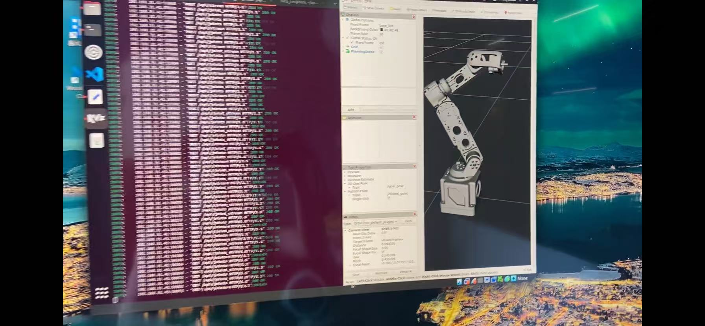
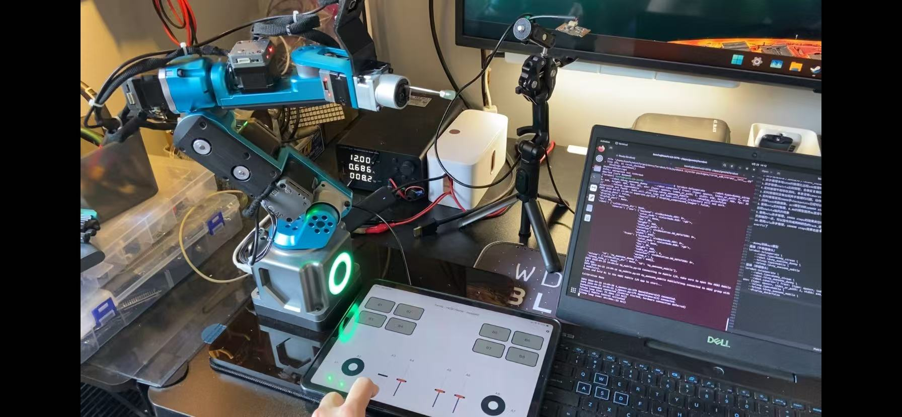

# 本工作区功能定位

1. 将开源机械臂Dummy接入MoveIt 2的相关代码与模型进行开源，以解决该领域技术资料匮乏的问题
2. 基于MoveIt 2持续扩展机械臂的上层应用功能

# 已发布功能模块

1. dummy-ros2_description：基于Fusion 360导出的URDF模型，导出脚本可参见相关独立项目
2. dummy_moveit_config：通过MoveIt Setup Assistant配置生成的Move Group配置，具体参考木子的项目及MoveIt 2官方文档
3. dummy_controller：实现MoveIt 2与真实机械臂Dummy的上下位机通信调用，集成了Dummy项目自带的ref_tool调用
4. dummy_server：实现通过Python代码调用MoveIt 2的运动规划相关功能
5. dummy_vision：Dummy与D435的手眼标定过程，配置调试笔记参见doc目录中的《Dummy手眼标定笔记.pdf》

# MoveIt流式控制Dummy

1. 该功能已更新至项目中，可通过MoveIt的Servo组件流式发送工具坐标系指令，MoveIt将实时逆解为J1至J6关节坐标进行运动，控制过程流畅，运动精度良好
2. 改动涉及dummy_controller和dummy_server两个模块

### 流式控制服务启动与调试

1. 启动MoveIt中的机械臂
ros2 launch dummy_moveit_config servo_streaming.launch.py

2. 启动MoveIt中的流式服务
cd ~/apps/dummy_ws
python src/dummy_server/server/stream_api_server.py（若控制无响应，可重复启动两次）

3. 测试演示程序
python src/dummy_server/server/stream_api_client_demo.py

#### 注意：详细笔记参见doc目录中的《moveit流式控制笔记.md》

# 使用Lerobot训练Dummy

相关内容可关注另一开源项目：
### https://github.com/hata8210/lerobot

# 后续规划内容

1. Dummy仿真环境强化学习
2. 夹爪的添加与控制

# 参考项目

> peng-zhihui开源的Dummy机械臂项目：https://github.com/peng-zhihui/Dummy-Robot.git

> 木子改良版本的机械臂项目：https://gitee.com/switchpi/dummy.git

> AndrejOrsula开源的MoveIt 2 Python调用工具库：https://github.com/AndrejOrsula/pymoveit2.git

> syuntoku14开源的Fusion导出URDF工具：https://github.com/syuntoku14/fusion2urdf

> Huggingface的Lerobot项目：https://github.com/huggingface/lerobot

# 使用声明

本工作区遵循相关开源项目的开源协议，相关代码不用于商业用途。
