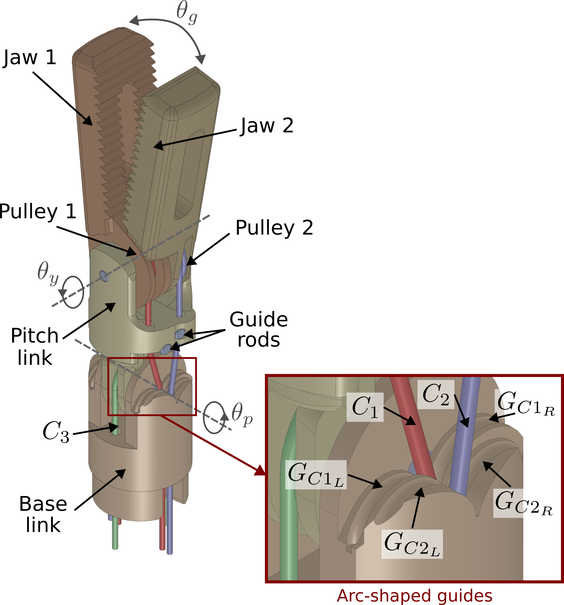
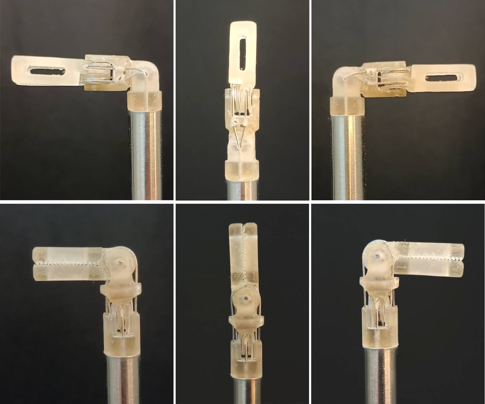
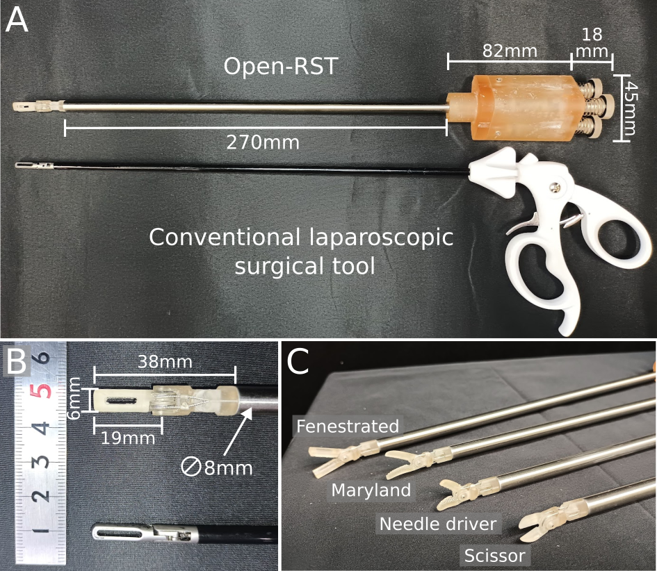
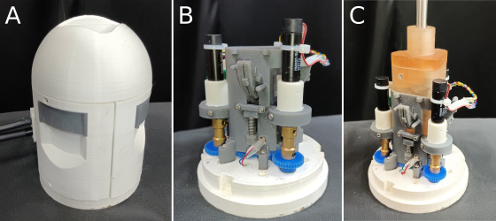
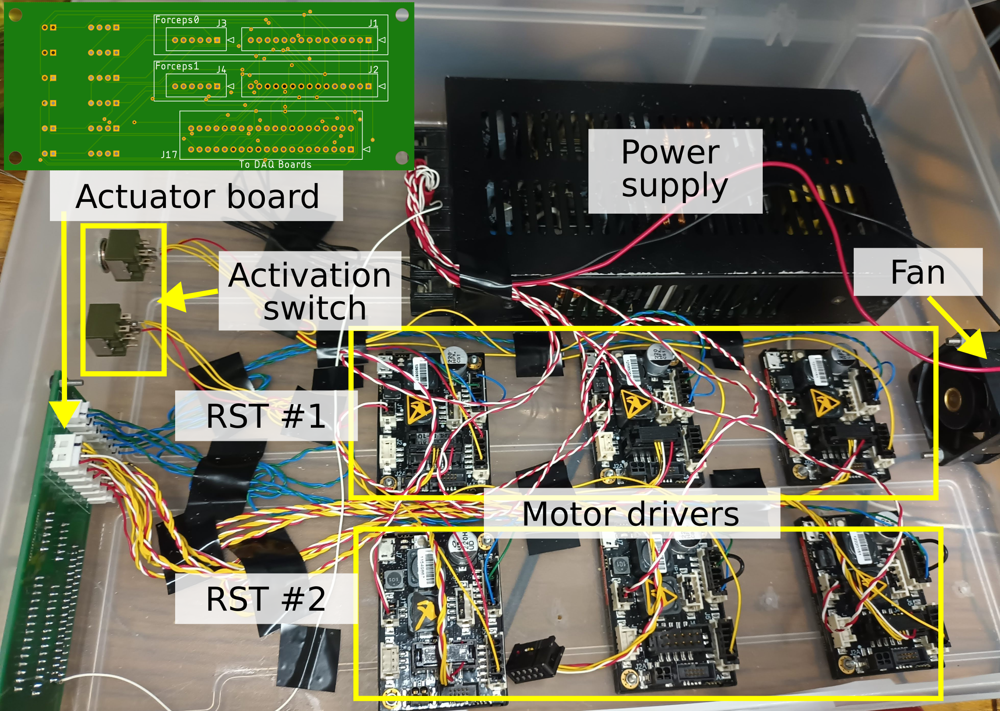
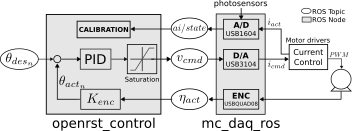
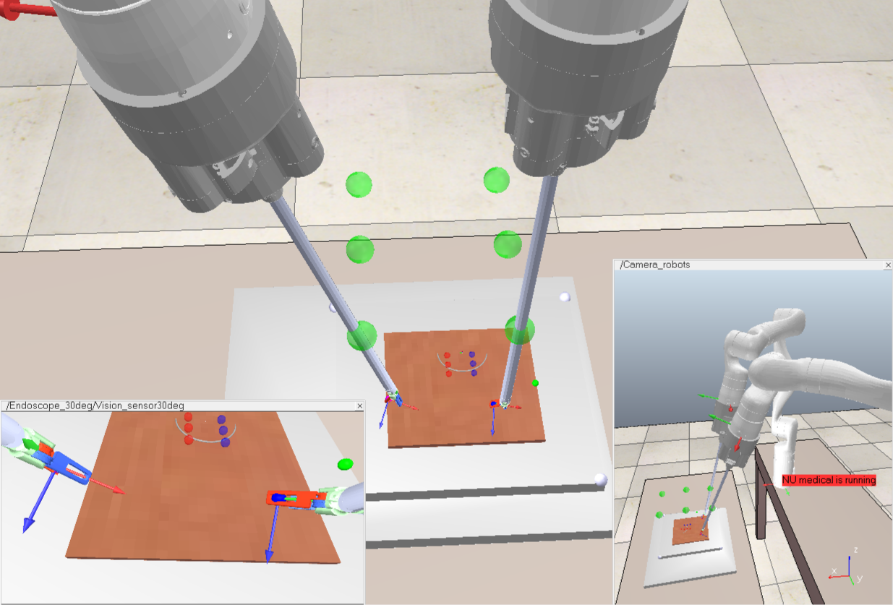
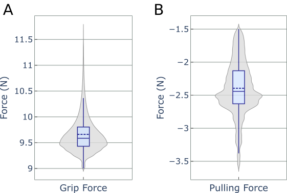
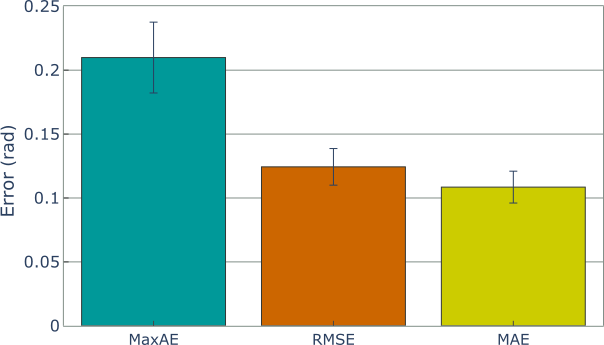

# OpenRST：面向定制化 3D 打印机器人手术器械的开源平台

欢迎访问 OpenRST 官方仓库，这是一个面向低成本、生物相容性、可定制化机器人手术器械的开源平台。

本项目旨在通过提供完全开源的替代方案，解决当前机器人手术器械成本高昂且供应有限的问题。所提出的设计包含一个具有解耦腕部机构的三自由度末端执行器、一个可分离式器械接口模块以及一个器械驱动单元。

设计与软件控制框架为开放获取，可自由用于定制化与快速开发。


*OpenRST 在抓取放置与缝合任务中的演示。*

## 核心特性

*   **低成本与可定制化：** 设计采用生物相容性材料通过 3D 打印制造，显著降低成本并支持便捷定制。
*   **可分离式绳驱末端执行器：** 具有新型解耦腕部机构的三自由度末端执行器，简化控制并提高精度。
*   **生物相容性设计：** 已针对适用于手术应用的生物相容性 3D 打印材料完成使用评估。
*   **紧凑型驱动单元：** 用于控制手术器械的紧凑型高性能驱动单元。
*   **开源软件：** 提供完整的基于 ROS 的控制框架，用于快速开发与集成。
*   **性能已验证：** 器械已验证可提供最高 10N 的夹持力，并具备高定位精度。

## 系统架构

OpenRST 平台由三个主要组件构成：

1.  **末端执行器：** 具有俯仰、偏航与抓取功能的三自由度腕部。解耦设计支持独立关节控制。
2.  **接口模块：** 将末端执行器连接至驱动单元的可分离式模块，支持快速器械更换。
3.  **驱动单元：** 包含用于驱动机动器械的电机与电子系统。

### 硬件

**末端执行器设计**

末端执行器采用解耦腕部机构，以确保各关节的平滑独立控制。

| 解耦腕部机构 | 已装配末端执行器 |
| :---: | :---: |
|  |  |

提供多种末端执行器设计，包括开窗钳型、马里兰钳型与持针钳型。



**接口模块（爆炸视图）**

接口模块设计用于快速器械更换。


**驱动单元（爆炸视图）**

驱动单元容纳电机、齿轮传动与控制板。


| 已装配驱动单元 | 控制器箱 |
| :---: | :---: |
|  |  |

### 软件

控制系统构建于机器人操作系统（ROS）之上。提供两个主要软件包：
*   `mc_daq_ros`：处理与 Measurement Computing 数据采集板的通信。
*   `openrst_control`：主控制节点，采用 `ros_control`。



同时提供 URDF 文件，用于便捷集成至 Gazebo 或 CoppeliaSim 等仿真环境。



## 性能指标

OpenRST 已通过严格测试，以确保满足手术应用需求。

| 夹持力与拉拔强度 | 角度跟踪误差 |
| :---: | :---: |
|  |  |

*   **夹持力：** 平均最大夹持力 9.6N。
*   **定位精度：** 平均绝对跟踪误差约 0.11 rad。
*   **扭矩传递效率：** 92.5%

## CAD 文件

CAD 文件按以下结构组织。提供用于 3D 打印的 STL 文件、用于互操作性的 STEP 文件，以及用于完全定制化的原始 SolidWorks 文件。

    CAD Files/
    ├── drive_unit/
    │   ├── STL/
    │   ├── STEP/
    │   └── SolidWorks/
    │       ├── Parts/
    │       └── Assemblies/
    ├── end_effector/
    │   ├── STL/
    │   ├── STEP/
    │   └── SolidWorks/
    │       ├── Parts/
    │       └── Assemblies/
    └── interface_module/
        ├── STL/
        ├── STEP/
        └── SolidWorks/
            ├── Parts/
            └── Assemblies/

## 引用

若在研究中使用 OpenRST，请引用以下论文：

```bibtex
@article{colan2023openrst,
  title={OpenRST: An Open platform for customizable 3D printed cable-driven Robotic Surgical Tools},
  author={Colan, Jacinto and Davila, Ana and Zhu, Yaonan and Aoyama, Tadayoshi and Hasegawa, Yasuhisa},
  journal={IEEE Access},
  year={2023},
  publisher={IEEE}
}
```

## 应用与更多引用

OpenRST 平台已应用于多项研究项目。以下为部分示例：

**面向自主机器人微创手术**
```bibtex
@article{fozilov2023toward,
  title={Toward autonomous robotic minimally invasive surgery: A hybrid framework combining task-motion planning and dynamic behavior trees},
  author={Fozilov, Khusniddin and Colan, Jacinto and Sekiyama, Kosuke and Hasegawa, Yasuhisa},
  journal={IEEE Access},
  volume={11},
  pages={91206--91224},
  year={2023},
  publisher={IEEE}
}
```

**基于潜回归的组织三角化模型预测控制**
```bibtex
@article{liu2024latent,
  title={Latent regression based model predictive control for tissue triangulation},
  author={Liu, Songtao and Colan, Jacinto and Zhu, Yaonan and Kobayashi, Taisuke and Misawa, Kazunari and Takeuchi, Masaru and Hasegawa, Yasuhisa},
  journal={Advanced Robotics},
  volume={38},
  number={5},
  pages={283--306},
  year={2024},
  publisher={Taylor \& Francis}
}
```

**基于过渡状态聚类的手术机器人辅助任务分割**
```bibtex
@INPROCEEDINGS{10155581,
  author={Yamada, Yutaro and Colan, Jacinto and Davila, Ana and Hasegawa, Yasuhisa},
  booktitle={2023 8th International Conference on Control and Robotics Engineering (ICCRE)}, 
  title={Task Segmentation Based on Transition State Clustering for Surgical Robot Assistance}, 
  year={2023},
  volume={},
  number={},
  pages={260-264},
  doi={10.1109/ICCRE57112.2023.10155581}}
```

**远程运动中心约束下机器人操作的实时逆运动学**
```bibtex
@article{davila2024real,
  title={Real-time inverse kinematics for robotic manipulation under remote center-of-motion constraint using memetic evolution},
  author={Davila, Ana and Colan, Jacinto and Hasegawa, Yasuhisa},
  journal={Journal of Computational Design and Engineering},
  volume={11},
  number={3},
  pages={248--264},
  year={2024},
  publisher={Oxford University Press}
}
```

## 路线图

正在持续改进 OpenRST 平台。当前工作重点为：

*   **迁移至 ROS2：** 正在更新控制软件以兼容 ROS2，为平台带来更高的稳定性、安全性与性能。

## 许可协议

本资源描述开放硬件，采用 CERN-OHL-S v2 许可。

可根据 CERN-OHL-S v2（https://ohwr.org/cern_ohl_s_v2.txt）的条款，重新分发和修改本资源，并使用其制造产品。

本资源按原样分发，不提供任何明示或暗示的担保，包括但不限于适销性、满意质量和特定用途适用性。请参阅 CERN-OHL-S v2 了解适用条件。

源位置：https://github.com/jcolan/OpenRST

根据 CERN-OHL-S v2 第 4 节，若基于本资源生产硬件，必须在可行情况下，在使用本资源制造的装置或其他产品的外壳上保持源位置可见。
